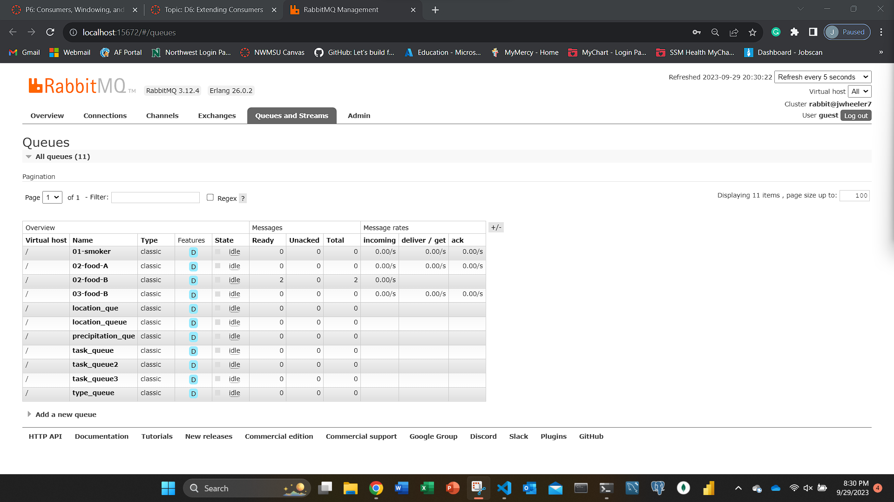
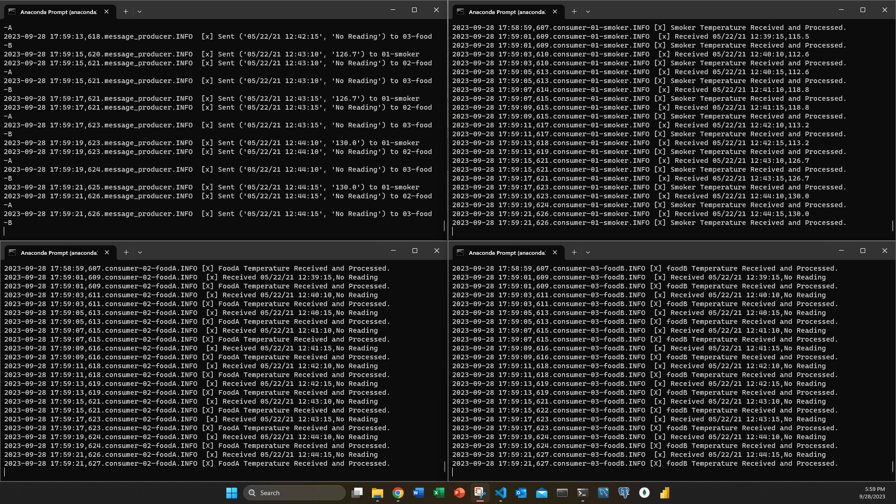
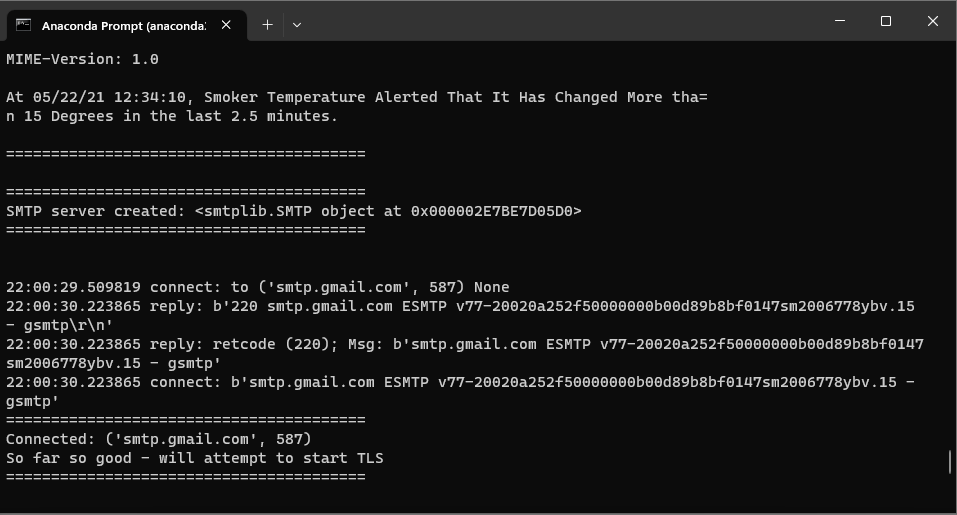
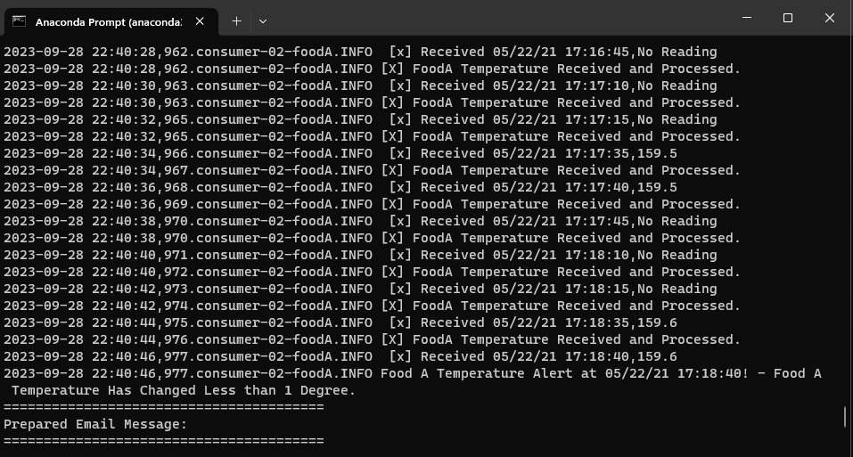
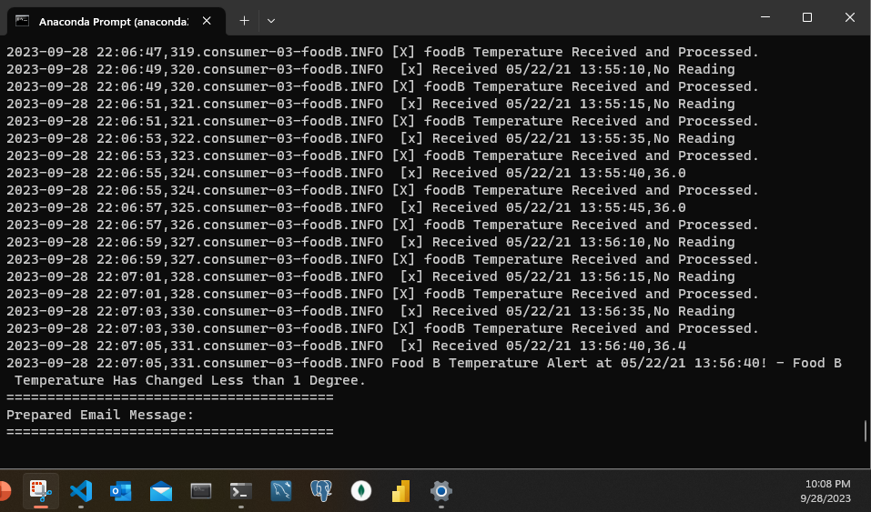
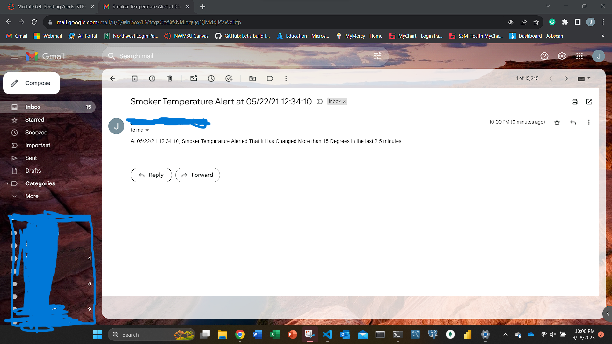
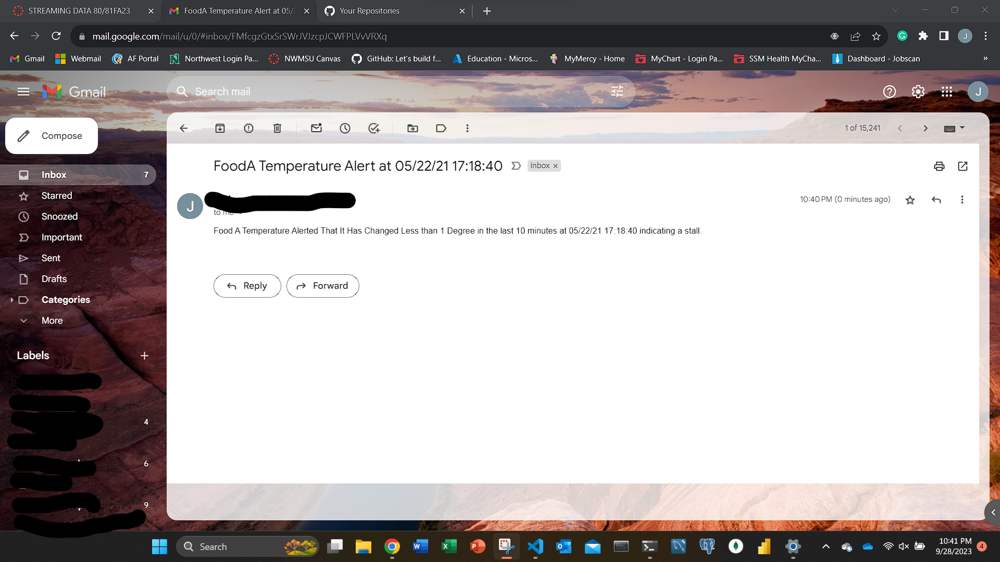
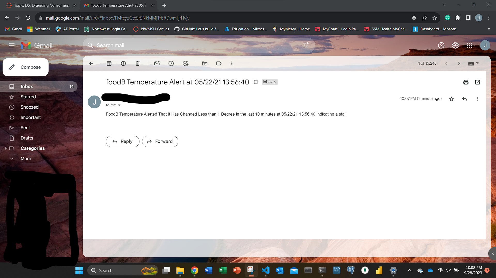

# streaming-05-smart-smoker
- [Jordan Wheeler](https://github.com/jordanwheeler7)
- CSIS 44671: Streaming Data
- Module 5/6: Creating a Producer
- 29 September 2023
- [Github Pages](https://jordanwheeler7.github.io/streaming-05-smart-smoker/)

## Overview
This repository serves as an example of streaming data. We demonstrate the process, design our system, and implement the producer. In this project, we create a producer to send three different temperature readings to consumers. Channel 1 tells us the temperature of the smoker itself. Channels 2 & 3 read the temperatures of two different meats. Utilizing RabbitMQ, we send this information to the different consumers for us to be able to analyze. Once analyzed, the consumer will send an email alert if the food temperature does not raise more than 1 degree over 10 minutes or if the smoker temperature changes by more than 15 degrees in 2.5 minutes.
[Data Source](smoker-temps.csv)

## Create a Virtual Environment
1. Open a terminal window
2. Navigate to the project folder
3. Type `python -m venv .venv` to create a virtual environment
4. Type `source .venv/bin/activate` to activate the virtual environment

## Requirements
1. Git
2. Python 3.7+ (3.11+ preferred)
3. VS Code Editor
4. VS Code Extension: Python (by Microsoft)
5. RabbitMQ Server installed and running locally
6. Pika installed into the virtual environment

## File Descriptions
- `message_producer.py` - This file is the producer that sends the messages to the consumers.
- `consumer_1.py` - This file is the consumer that receives the messages from the producer and sends an email alert if the smoker temperature changes by more than 15 degrees in 2.5 minutes.
- `consumer_2.py` - This file is the consumer for foodA that receives the messages from the producer and sends an email alert if the food temperature does not raise more than 1 degree over 10 minutes.
- `consumer_3.py` - This file is the consumer for foodB that receives the messages from the producer and sends an email alert if the food temperature does not raise more than 1 degree over 10 minutes.  
- `smoker-temps.csv` - This file is the data source for the producer to send to the consumers.
- `email_alert.py` - This file is the email alert that is sent to the user if the temperature changes by more than 15 degrees in 2.5 minutes or if the food temperature does not raise more than 1 degree over 10 minutes.
- `.env-example.toml` - This file is the example of the .env file that is used to store the email address and password.

## Running the Code
Open up a terminal window and navigate to the file in which you have saved the repository (I use `cd C:\Users\{filepath}`). Once there, start running your virtual environment(`.venv\Scripts\activate`). Once activated, run `python message_producer.py`. The file will ask you if you want to open RabbitMQ in admin mode, type y for yes and n for no; "guest" is the name and password. Once activated, the file will produce a message every 30 seconds, and a confirmation is sent. Due to this being a durable queue, the file will continue to run until it reaches the end or the user enters `Ctrl + C`. Once ended the queue will be deleted and start again upon the next activation.

Running the consumers is similar to running the producer. 
1. Open up a terminal window and navigate to the file in which you have saved the repository (I use `cd C:\Users\{filepath}`).
2. Once there, start running your virtual environment.
3. Once activated, run `python consumer_1.py` for the smoker temperature.
4. Open another 2 more terminals and type `python consumer_2.py` for foodA, and `python consumer_3.py` for foodB in those terminals.
5. They will continue to listen until you close out of it using `Ctrl + C` or an interuption occurs.

## Notes
- If you want to use the email alert, you will need to create a .env.toml file and store your email address and password in it. I have included an example of the .env file that I used.
- It is important to add this to your gitignore file so that it is not uploaded to github.
- If using [Gmail](https://support.google.com/accounts/answer/185833?hl=en) follow this link to get an app password setup.
- I had an issue with emails being sent on my primary ISP. When I switched to my backup, I did not have any issues. The ports were not open on my primary ISP, if you run into a timeout issue, you may need to check your ports.

To run the consumer codes, you 

## Screenshots of Running Code

## Smoker Alert

## Food A Alert

## Food B Alert

## Smoker Email Screenshot

## Food A Email Screenshot
   
## Food B Email Screenshot 

